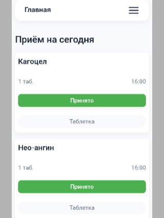

# Умная аптечка

Проект на Typescript "Умная аптечка" создан, чтобы помочь людям не забывать принимать лекарства или витамины, и отслеживать свой курс лечения, а также остатки препаратов. А также он поможет людям не забыть, чем они лечились, ведь все курсы лечения будут храниться в архиве.

## Преимущества Typescript

За то время, пока я писала проект, я поняла, насколько удобен Typescript.

* Типизация помогает избежать ошибок в runtime, поэтому у меня не было такой проблемы, как строка оказалась в месте, где должно было быть число
* Interface, как способ именования типа объекта, помог мне не ошибиться в типе свойства, а также быстрее понять, подходит ли эта структура для того, что я задумала реализовать
* Благодаря Typescript рефакторинг кода и изменения стало проще реализовать, ведь он подсвечивает все несостыковки моментально
* Мне было легко и удобно переиспользовать функции благодаря псевдониму типов "Type" и дженерикам.

## Основной функционал приложения

* При открытии приложения пользователь оказывается на главной странице:
    * Список **"Приём на сегодня"** отображает, какие лекарства нужно принять сегодня. Нельзя нажать "Принято" раньше, чем за 15 минут до указанного времени. Если после этого времени ещё прошло 15 минут и пользователь не нажал "Принято", лекарство попадает в список пропущенных
    * В списке **"Пропущенные"** я лекарства есть две кнопки "Принять" и "Удалить из пропущенных". Последняяя кнопка просто удалит, без вычитания дозировки из остатка
    * В списке **"Скоро закончатся (таблетки и порошки)"** с помощью кнопки "Пополнить" можно перейти к редактированию.
    * Кнопка **"Добавить приём"** открывает модальное окно с формой. В ней нужно заполнить: название болезни, дата окончания приёма, название лекарства, время приёма (можно добавить несколько) и в зависимости от формы лекарства дозировку или остаток. Также можно добавить ещё лекарство.

* В секции **"Активные"** хранится список лечений, которые действуют на данный момент. При клике на лечение, открывается страница редактирования, где можно удалить или добавить лекарства, что-то поменять.

* В секции **"Каленадрь"** серым цветом выделены дни, когда нужно принимать лекарства. Красный крестик означает, что пользователь забыл принять или отметить, а зеленая галочка появляется, когда все принято и пользователь отметил это в календаре.

* В секцию **"Архив"** попадают законченные курсы, которые потом можно назначить снова.

## Технологии

* HTML5(семантическая разметка)
* SCSS (переменные, миксины, адаптивный дизайн)
* Typescript - версия 5.9.3 (ES6, interface, type, дженерики)

## Запуск приложения

Просто перейдите по ссылке - [Умная аптечка](https://alinalukyanova25.github.io/med-tracker/)

## Архитектура проекта

Проект использует модульную архитектуру с четким разделением ответственности:

* Файлы в папка **core/** содержат общие функции, основные сервисы и работу с LocalStorage
* Файлы в папке **managers/** содержат классы, управляющие разделами приложения
* Файлы в папке **ui/** содержат чистые функции рендеринга
* Файлы в папке **types/** содержат функции с дженериками, функции, связанные с типами, интерфейсы, псевдонимы типа, объединения
* Accessibility - полная навигация с клавиатуры